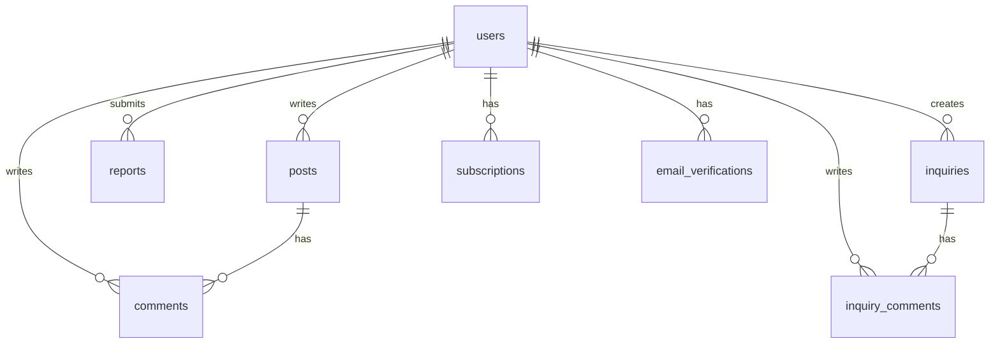
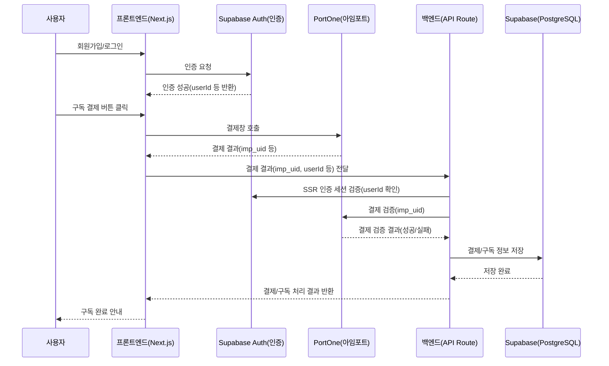

# Phone8ez Dashboard 구현 방향 (2024.06 최신)

## 📋 개요
Phone8ez의 대시보드는 모바일 판매 전문가를 위한 데이터 분석 및 관리 플랫폼의 핵심 기능입니다.

## 🎯 주요 기능 및 데이터 흐름

### 1. 데이터 입력 및 저장
- 사용자는 '데이터 입력' 탭에서 시트(테이블) 형태로 데이터를 입력할 수 있습니다.
- 입력 후 '저장하기' 버튼을 누르면, **사용자가 직접 이름을 지정**하여 데이터 세트로 저장합니다.
- 저장 위치는 '로컬 데이터' 또는 'Cloud 데이터' 중 선택할 수 있습니다.
- 여러 개의 데이터 세트를 저장/관리할 수 있습니다.
- **로컬 데이터는 휘발성(userState)으로 저장되며, 브라우저 탭/윈도우를 닫으면 자동 삭제됩니다.**
- **영구 보관이 필요한 경우, 구독 플랜을 통해 로컬 다운로드 기능을 이용해야 합니다.**

### 2. 데이터 불러오기 및 편집
- 상단 카드(로컬 데이터/Cloud 데이터)에 저장된 데이터 세트들은 버튼 형태로 나열됩니다.
- 사용자는 이 버튼을 클릭하여 해당 데이터 세트를 '데이터 입력' 시트에 불러와 바로 수정할 수 있습니다.
- 불러온 데이터는 수정 후 다시 저장(이름 지정)하여 새로운 데이터 세트로 추가할 수 있습니다.

### 3. 데이터 관리 및 활용
- **데이터 카드**: 브라우저에 저장된 데이터 세트 관리
- 클라우드 온오프 스위치로 클라우드에 업로드, 다운로드 또는 로컬에 업로드 다운로드를 선택할 수 있습니다.
- **데이터는 userState에 저장되어, 브라우저/탭 종료 시 자동 삭제됩니다.**
- **구독 플랜 사용자는 로컬 데이터 다운로드(영구 저장) 기능을 사용할 수 있습니다.**
- 데이터 세트는 버튼 형태로 나열됩니다.
- 여러 데이터 세트를 선택/합쳐서 다운로드하거나, Cloud로 업로드할 수 있습니다.

### 4. 탭별 역할
- **데이터 입력**: 데이터 입력, 불러오기, 저장(이름 지정), 수정 등
- **통합 데이터**: 로컬/Cloud 데이터의 모든 자료를 한 번에 조회/필터링
- **모델별 데이터**: 모델명/모델번호로 필터링, 해당 모델의 할인 내역, 출고가, 최종 가격을 한눈에 볼 수 있음
- **데이터 시각화**: (추후 아이디어 논의 및 구현)

### 5. 데이터 흐름 요약
1. 데이터 입력 → 저장(이름 지정, 로컬/Cloud 선택) → 상단 카드에 버튼 추가
2. 상단 카드에서 데이터 불러오기 → 시트에 적용/수정 → 저장(새 이름)
3. 통합 데이터/모델별 데이터 탭에서 모든 자료를 필터링/조회/활용

## 🖼️ UI/UX 예시
- 상단 카드: [로컬 데이터] [Cloud 데이터] (각각 버튼으로 데이터 세트 표시)
- 데이터 입력 탭: 시트 + 저장하기(이름 입력) + 불러오기(상단 카드에서)
- 통합 데이터 탭: 모든 데이터 세트 표/필터링
- 모델별 데이터 탭: 모델 선택 → 할인/출고가/최종가 한눈에 보기

## 🛠️ 기술 및 기타 사항
- 프론트엔드: Next.js, React, TypeScript, TailwindCSS
- 상태 관리: React Hooks
- DB: **Supabase(PostgreSQL)** (Cloud 데이터)
- 데이터 저장: 로컬스토리지(로컬 데이터), **Supabase(PostgreSQL) DB(Cloud 데이터)**
- 파일/이미지 업로드: **Supabase Storage**
- 향후 데이터 시각화/고급 분석 기능 추가 예정

## ⚠️ 주의 및 개선사항
- 기존 '로컬 데이터 입력' → '데이터 입력'으로 명칭 변경
- 기존 'DB 연동 데이터' → '통합 데이터'로 명칭 및 역할 변경
- Cloud 데이터는 DB 연동 및 저장/불러오기/삭제/다운로드 지원
- 데이터 시각화 탭은 추후 아이디어 논의 후 구현
- 모든 데이터 세트는 이름 지정 필수, 여러 개 관리 가능
- 데이터 불러오기/수정/저장 흐름 명확화

---

이 문서는 2024년 6월 기준 최신 요구사항을 반영하여 작성되었습니다. 추가/변경 사항 발생 시 계속 업데이트 바랍니다.

## 🎯 주요 기능
1. 데이터 관리
   - 로컬/클라우드 데이터 입력/관리
   - 통합 데이터 관리
   - 모델별 데이터 분석   - 데이터 시각화

2. 구독 시스템
   - 무료 플랜 (기본 기능)
   - 프로 플랜 (고급 기능)
   - 관리자 기능
   - **프로 플랜(구독) 사용자는 로컬/Cloud 데이터의 영구 다운로드(보관) 기능을 사용할 수 있습니다.**

## 💻 기술 스택
- Frontend: Next.js (App Router), React, TypeScript
- Styling: TailwindCSS
- State Management: React Hooks
- Icons: Lucide Icons

## 🎨 UI 구조

### 1. 상단 카드 섹션
- 로컬 데이터/Cloud 데이터
  - 다운로드/업로드 기능
- 구독 상태
  - 현재 플랜 표시
  - 구독 관리 기능

### 2. 탭 메뉴
- 데이터 입력
- 통합 데이터
- 모델별 데이터
- 데이터 시각화

### 3. 데이터 테이블
- 고정 첫 번째 열
- 헤더 레이블:
  - 통신사
  - 지원구분
  - 요금제
  - 가입유형
  - 업체명

## 🔄 상태 관리
```typescript
const [tab, setTab] = useState<'local'|'db'|'model'|'viz'>('local');
const [dataName, setDataName] = useState('');
const [dataContent, setDataContent] = useState('');
```

## 🎨 스타일링
- 메인 컬러: 파란색 계열
  - 배경: from-blue-50 to-white
  - 테두리: border-blue-100
  - 텍스트: text-blue-700
  - 버튼: bg-blue-600
- 폰트
  - 제목: SUIT Bold/Noto Sans KR
  - 본문: Pretendard Regular
- 반응형 디자인
- 다크모드 지원

## 📦 백업 고려사항

### 1. 데이터 백업
- 상태값 (useState)
- 테이블 데이터 구조
- 사용자 설정값

### 2. 스타일 백업
- Tailwind CSS 클래스
- 커스텀 스타일링
- 반응형 설정

### 3. 컴포넌트 구조
- 테이블 구조
- 탭 메뉴
- 카드 컴포넌트

### 4. 기능 백업
- 엑셀 컬럼명 생성 로직
- 테이블 스크롤 처리
- 탭 전환 로직

### 5. 환경 설정
- 의존성 패키지
- 환경 변수
- API 엔드포인트

### 6. 테스트 데이터
- 샘플 데이터
- 테스트 케이스
- 시나리오

## �� 실제 Supabase 데이터베이스/스토리지 구조

- **DB**: Supabase(PostgreSQL)
  - users, posts, comments, subscriptions 등 모든 데이터 테이블
  - uuid, text[], timestamptz 등 실제 타입 사용
  - RLS(행 수준 보안) 정책 적용
- **스토리지**: Supabase Storage
  - 이미지, 파일 업로드/다운로드 지원
  - 예시: `supabase.storage.from('bucket').upload(...)`, `supabase.storage.from('bucket').getPublicUrl(...)`

## 🧩 주요 확장(Extensions)
- uuid-ossp: UUID 생성
- pgcrypto: 암호화/랜덤
- supabase_vault: 보안 비밀 저장소
- pg_stat_statements: 쿼리 통계
- pg_graphql: GraphQL 지원
- vector: 벡터 데이터 타입/검색
- postgis: 공간 데이터
- citext: 대소문자 구분 없는 문자열
- pgsodium: libsodium 암호화
- 기타: tablefunc, http, unaccent, bloom 등

## 🔄 데이터베이스 관계도


## 📊 데이터베이스 백업 전략
1. 정기적 백업
   - 일일 전체 백업
   - 시간별 증분 백업
   - 트랜잭션 로그 백업

2. 백업 저장소
   - 로컬 스토리지
   - 클라우드 스토리지
   - 외부 백업 서비스

3. 복구 절차
   - 전체 복구
   - 시점 복구
   - 선택적 복구

4. 모니터링
   - 백업 상태 확인
   - 디스크 공간 모니터링
   - 백업 성능 모니터링

## 🔍 향후 개선사항
1. 데이터 연동 기능 구현
2. 실시간 데이터 업데이트
3. 고급 데이터 분석 기능
4. 사용자 커스터마이징 옵션
5. 성능 최적화

## ⚠️ 주의사항
1. 데이터 보안
2. 사용자 권한 관리
3. 대용량 데이터 처리
4. 브라우저 호환성
5. 반응형 디자인 유지 

## 🛠️ 외부 서비스 및 툴

### 1. 인증 및 보안
- **Supabase Auth (SSR 인증 지원)**
  - 이메일/비밀번호 인증
  - 소셜 로그인 통합
  - 사용자 관리
  - 세션 관리(SSR 지원)
  - Next.js API Route에서 `@supabase/auth-helpers-nextjs`의 `createRouteHandlerClient({ cookies })`로 SSR 인증 적용
  - 프론트 fetch 요청에 `credentials: 'include'` 옵션 필수

### 2. 결제 시스템
- **PortOne(아임포트)**
  - 구독 결제 처리
  - 결제 이력 관리
  - 환불 처리
  - 웹훅 통합

### 3. 데이터베이스
- **Supabase(PostgreSQL)**
  - 로컬 데이터 저장
  - 트랜잭션 관리
  - 백업 및 복구
  - 마이그레이션

### 4. 클라우드 인프라

- **Vercel**
  - Next.js 호스팅
  - 글로벌 CDN
  - 서버리스 함수 지원
  - 자동 배포

### 5. 모니터링 및 에러 추적
- **Sentry**
  - 에러 추적
  - 성능 모니터링
  - 사용자 피드백
  - 실시간 알림

### 6. 캐싱 및 메시징
- **Upstash**
  - Redis 캐싱
  - 실시간 메시징
  - 작업 큐
  - 이벤트 처리

## 🔄 서비스 통합 흐름도
```mermaid
graph TD
    A[사용자] --> B[Supabase Auth]
    B --> C[인증]
    C --> D[대시보드]
    D --> E[Supabase(PostgreSQL)]
    D --> F[Cloudflare R2]
    D --> G[PortOne(아임포트)]
    G --> H[결제 처리]
    I[Sentry] --> D
    J[Upstash] --> D
    K[Cloudflare Workers] --> D
    D --> J[Vercel]
    J --> D
```

## 📊 서비스별 주요 기능

### Supabase Auth
- 사용자 인증
- 소셜 로그인
- 세션 관리
- 보안 정책

### PortOne(아임포트)
- 구독 관리
- 결제 처리
- 웹훅
- 환불 처리

### Supabase(PostgreSQL)
- 데이터 저장
- 쿼리 처리
- 트랜잭션
- 백업/복구

### Vercel
- Next.js 호스팅
- 글로벌 CDN
- 서버리스 함수 지원
- 자동 배포
- 환경 변수 관리
- GitHub 연동
- 미리보기 배포

### Sentry
- 에러 추적
- 성능 모니터링
- 사용자 피드백
- 알림

### Upstash
- 캐싱
- 메시징
- 작업 큐
- 이벤트

## ⚠️ 서비스 통합 주의사항
1. API 키 보안
2. 서비스 제한사항 확인
3. 비용 관리
4. 장애 대응
5. 백업 전략 

## 📝 진행 상황 추적

### 🟢 완료된 사항
1. 프로젝트 기본 구조 설정
   - Next.js 프로젝트 초기화
   - TypeScript 설정
   - TailwindCSS 설정
   - 기본 레이아웃 구성

2. 대시보드 기본 UI 구현
   - 상단 카드 섹션
   - 탭 메뉴 구조
   - 데이터 테이블 기본 구조

### 🟡 진행 중인 사항
1. 데이터 연동
   - Supabase(PostgreSQL) 데이터베이스 설정
   - Supabase Auth 인증 연동
   - Cloudflare Workers API 구성

2. UI/UX 개선
   - 다크모드 구현
   - 반응형 디자인 보완
   - 애니메이션 효과 추가

### 🔴 예정된 사항
1. 결제 시스템
   - PortOne(아임포트) 연동
   - 구독 플랜 구현
   - 결제 이력 관리

2. 고급 기능
   - 데이터 시각화
   - 실시간 업데이트
   - 고급 분석 도구

### 📌 변경된 사항
1. 데이터베이스
   - Turso에서 Supabase(PostgreSQL)로 변경
   - 로컬 스토리지 전략 수정

2. 인프라
   - Cloudflare R2 스토리지 추가
   - Hyperdrive 캐싱 도입

### ⚠️ 기억해야 할 사항
1. 보안
   - API 키는 환경 변수로 관리
   - 사용자 인증 상태 확인
   - 데이터 접근 권한 검증

2. 성능
   - 이미지 최적화
   - 데이터 캐싱 전략
   - API 응답 시간 모니터링

3. 사용자 경험
   - 로딩 상태 표시
   - 에러 메시지 처리
   - 모바일 최적화

4. 개발 프로세스
   - 코드 리뷰 필수
   - 테스트 코드 작성
   - 문서화 유지

### 📅 마일스톤
1. 알파 버전 (2025.06)
   - 기본 기능 구현
   - 내부 테스트

2. 베타 버전 (2025.07)
   - 사용자 피드백 수집
   - 버그 수정

3. 정식 출시 (2025.07)
   - 안정화
   - 마케팅 시작

---

## 📁 대시보드 폴더 및 연결 구조

```
src/
├── app/
│   └── dashboard/
│       ├── components/
│       │   ├── cards/                # 데이터 카드, 구독 카드 등
│       │   │   ├── DataCard.tsx
│       │   │   └── SubscriptionCard.tsx
│       │   ├── common/               # 공통 UI (탭, 헤더 등)
│       │   │   └── TabContent.tsx
│       │   ├── data-input/           # 데이터 입력 탭
│       │   │   ├── DataInputSheet.tsx
│       │   │   ├── DataInputHeader.tsx
│       │   │   ├── modals/
│       │   │   │   ├── UploadModal.tsx
│       │   │   │   └── ImportModal.tsx
│       │   │   └── index.tsx
│       │   ├── integrated/           # 통합 데이터 탭
│       │   │   ├── IntegratedSheet.tsx
│       │   │   ├── IntegratedHeader.tsx
│       │   │   ├── modals/
│       │   │   │   └── MergeModal.tsx
│       │   │   └── index.tsx
│       │   ├── model/                # 모델별 데이터 탭
│       │   │   ├── Sheet.tsx
│       │   │   └── index.tsx
│       │   ├── visualization/        # 데이터 시각화 탭
│       │   │   ├── charts/
│       │   │   └── index.tsx
│       │   └── shared/               # (필요시) 공통 모달 등
│       ├── hooks/                    # 대시보드 전용 훅
│       ├── utils/                    # 대시보드 전용 유틸리티
│       │   ├── data-input/
│       │   │   └── sheetOperations.ts
│       │   ├── integrated/
│       │   │   └── mergeOperations.ts
│       │   ├── model/
│       │   ├── visualization/
│       │   └── common/
│       │       └── fileHandling.ts
│       └── page.tsx                  # 대시보드 진입점
│
├── lib/                              # 외부 공통 라이브러리/유틸리티
│   └── (예: dark-mode.tsx, support-amounts.ts 등)
├── styles/                           # 공통 스타일, Tailwind, theme 등
│   └── (예: common.ts, tailwind.config.ts 등)
├── types/                            # 전역 타입 정의
│   └── dashboard.ts                  # 대시보드 데이터/시트 타입 등
│   └── (기타 공통 타입)
```

### 🔗 연결 구조
- **components** 내부 각 탭/카드/공통 컴포넌트는 필요에 따라 `lib/`, `styles/`, `types/`의 함수, 스타일, 타입을 import하여 사용
- **utils** 폴더는 대시보드 내부에서만 사용하는 유틸리티를 관리하며, 공통 유틸리티는 `lib/`에서 import
- **types/dashboard.ts**는 대시보드 전용 타입을 정의하며, 각 탭/유틸리티/컴포넌트에서 import

---

## 🛡️ 전체 서비스 아키텍처 및 데이터 흐름 (Supabase Auth + PortOne + Supabase(PostgreSQL/Storage))

### 1. 인증(로그인) - Supabase Auth (SSR)
- 사용자는 Supabase Auth를 통해 회원가입/로그인(이메일, 소셜 등)
- 로그인 성공 시 Supabase가 사용자 세션 및 인증 토큰을 관리(SSR/CSR 모두 지원)
- 프론트엔드에서는 Supabase의 useUser(), useSession() 등으로 로그인 상태, 사용자 정보, userId 등을 확인
- **API Route(서버)에서는 반드시 `createRouteHandlerClient({ cookies })`로 SSR 인증 세션을 읽어야 함**

### 2. 구독 결제 - PortOne(아임포트)
- 로그인한 사용자가 구독 결제 버튼 클릭
- 프론트엔드에서 PortOne(아임포트) JS SDK로 결제창 호출
- 결제 성공 시, PortOne에서 결제 결과(imp_uid, merchant_uid 등)를 콜백으로 전달
- 결제 결과를 백엔드 API로 전송하여 결제 검증 및 DB 저장

### 3. 데이터 저장 - Supabase(PostgreSQL)
- 백엔드(Next.js API Route 또는 서버리스 함수)에서
  1. Supabase의 인증 토큰으로 사용자 인증(userId 확인)
  2. PortOne REST API로 결제 검증(imp_uid 등으로 실제 결제 성공 여부 확인)
  3. 결제 정보(구독 시작/종료일, 결제 상태, userId 등)를 Supabase(PostgreSQL) DB에 저장
- 이후 구독 상태, 결제 이력, 사용자 정보 등은 Supabase(PostgreSQL) DB에서 관리

### 실제 서비스 흐름 예시


### 실제 코드 구조 예시 (SSR 인증)
- 프론트엔드: Supabase Auth로 로그인 상태 확인, PortOne 결제창 호출, 결제 결과를 Next.js API Route로 전달
- 백엔드(API Route): SSR 인증 세션(`createRouteHandlerClient({ cookies })`)으로 사용자 인증, PortOne 결제 검증, Supabase(PostgreSQL) DB에 결제/구독 정보 저장

#### SSR 인증 적용 예시 (Next.js API Route)
```typescript
import { createRouteHandlerClient } from '@supabase/auth-helpers-nextjs';
import { cookies } from 'next/headers';

export async function POST(req: Request) {
  const supabase = createRouteHandlerClient({ cookies });
  const { data: { user } } = await supabase.auth.getUser();

  if (!user) {
    return new Response(JSON.stringify({ error: '로그인이 필요합니다.' }), { status: 401 });
  }

  // ...비즈니스 로직...
}
```

#### 프론트엔드 fetch 요청 예시
```typescript
await fetch('/api/posts', {
  method: 'POST',
  body: JSON.stringify({ ... }),
  headers: { 'Content-Type': 'application/json' },
  credentials: 'include', // SSR 인증 필수 옵션
});
```

#### SSR 인증 환경 주의사항
- 배포 환경에서는 반드시 HTTPS, 동일 도메인/서브도메인, SameSite=Lax 또는 None, Secure 옵션 필요
- 쿠키가 실제로 API 요청에 포함되는지 크롬 개발자도구로 확인

### 각 서비스별 역할 요약
- **Supabase Auth**: 사용자 인증/세션 관리(SSR/CSR), userId 등 사용자 정보 제공
- **PortOne(아임포트)**: 결제창 제공, 결제 결과 콜백, 결제 검증 API 제공
- **Supabase(PostgreSQL)**: 사용자, 구독, 결제 이력 등 모든 데이터 저장, 구독 상태/권한 체크 등 비즈니스 로직에 활용
