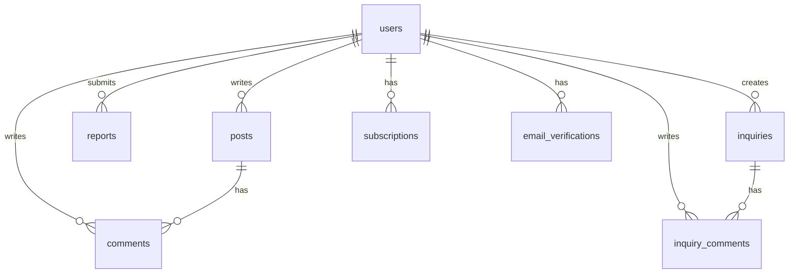

# Phone8ez Dashboard 구현 방향 (2024.06 최신, Vercel + Supabase)

## 📋 개요
Phone8ez의 대시보드는 모바일 판매 전문가를 위한 데이터 분석 및 관리 플랫폼의 핵심 기능입니다.

## 🎯 주요 기능 및 데이터 흐름

### 1. 데이터 입력 및 저장
- 사용자는 '데이터 입력' 탭에서 시트(테이블) 형태로 데이터를 입력할 수 있습니다.
- 입력 후 '저장하기' 버튼을 누르면, **사용자가 직접 이름을 지정**하여 데이터 세트로 저장합니다.
- 저장 위치는 '로컬 데이터' 또는 'Cloud 데이터' 중 선택할 수 있습니다.
- 여러 개의 데이터 세트를 저장/관리할 수 있습니다.
- **로컬 데이터는 휘발성(userState)으로 저장되며, 브라우저 탭/윈도우를 닫으면 자동 삭제됩니다.**
- **영구 보관이 필요한 경우, 구독 플랜을 통해 로컬 다운로드 기능을 이용해야 합니다.**

### 2. 데이터 불러오기 및 편집
- 상단 카드(로컬 데이터/Cloud 데이터)에 저장된 데이터 세트들은 버튼 형태로 나열됩니다.
- 사용자는 이 버튼을 클릭하여 해당 데이터 세트를 '데이터 입력' 시트에 불러와 바로 수정할 수 있습니다.
- 불러온 데이터는 수정 후 다시 저장(이름 지정)하여 새로운 데이터 세트로 추가할 수 있습니다.

### 3. 데이터 관리 및 활용
- **데이터 카드**: 브라우저에 저장된 데이터 세트 관리
- 클라우드 온오프 스위치로 클라우드에 업로드, 다운로드 또는 로컬에 업로드 다운로드를 선택할 수 있습니다.
- **데이터는 userState에 저장되어, 브라우저/탭 종료 시 자동 삭제됩니다.**
- **구독 플랜 사용자는 로컬 데이터 다운로드(영구 저장) 기능을 사용할 수 있습니다.**
- 데이터 세트는 버튼 형태로 나열됩니다.
- 여러 데이터 세트를 선택/합쳐서 다운로드하거나, Cloud로 업로드할 수 있습니다.

### 4. 탭별 역할
- **데이터 입력**: 데이터 입력, 불러오기, 저장(이름 지정), 수정 등
- **통합 데이터**: 로컬/Cloud 데이터의 모든 자료를 한 번에 조회/필터링
- **모델별 데이터**: 모델명/모델번호로 필터링, 해당 모델의 할인 내역, 출고가, 최종 가격을 한눈에 볼 수 있음
- **데이터 시각화**: (추후 아이디어 논의 및 구현)

### 5. 데이터 흐름 요약
1. 데이터 입력 → 저장(이름 지정, 로컬/Cloud 선택) → 상단 카드에 버튼 추가
2. 상단 카드에서 데이터 불러오기 → 시트에 적용/수정 → 저장(새 이름)
3. 통합 데이터/모델별 데이터 탭에서 모든 자료를 필터링/조회/활용

## 🖼️ UI/UX 예시
- 상단 카드: [로컬 데이터] [Cloud 데이터] (각각 버튼으로 데이터 세트 표시)
- 데이터 입력 탭: 시트 + 저장하기(이름 입력) + 불러오기(상단 카드에서)
- 통합 데이터 탭: 모든 데이터 세트 표/필터링
- 모델별 데이터 탭: 모델 선택 → 할인/출고가/최종가 한눈에 보기

## 🛠️ 기술 및 기타 사항
- 프론트엔드: Next.js (Vercel 배포), React, TypeScript, TailwindCSS
- 상태 관리: React Hooks
- DB/인증/스토리지: **Supabase(Postgres, Auth, Storage)**
- 데이터 저장: 로컬스토리지(로컬 데이터), Supabase DB(Cloud 데이터)
- 향후 데이터 시각화/고급 분석 기능 추가 예정

## ⚠️ 주의 및 개선사항
- 기존 '로컬 데이터 입력' → '데이터 입력'으로 명칭 변경
- 기존 'DB 연동 데이터' → '통합 데이터'로 명칭 및 역할 변경
- Cloud 데이터는 Supabase DB 연동 및 저장/불러오기/삭제/다운로드 지원
- 데이터 시각화 탭은 추후 아이디어 논의 후 구현
- 모든 데이터 세트는 이름 지정 필수, 여러 개 관리 가능
- 데이터 불러오기/수정/저장 흐름 명확화

---

이 문서는 2024년 6월 기준 최신 요구사항을 반영하여 작성되었습니다. 추가/변경 사항 발생 시 계속 업데이트 바랍니다.

## 🎯 주요 기능
1. 데이터 관리
   - 로컬/클라우드 데이터 입력/관리
   - 통합 데이터 관리
   - 모델별 데이터 분석   - 데이터 시각화

2. 구독 시스템
   - 무료 플랜 (기본 기능)
   - 프로 플랜 (고급 기능)
   - 관리자 기능
   - **프로 플랜(구독) 사용자는 로컬/Cloud 데이터의 영구 다운로드(보관) 기능을 사용할 수 있습니다.**

## 💻 기술 스택
- Frontend: Next.js (App Router), React, TypeScript
- Styling: TailwindCSS
- State Management: React Hooks
- DB/인증/스토리지: **Supabase(Postgres, Auth, Storage)**
- Icons: Lucide Icons

## 🎨 UI 구조

### 1. 상단 카드 섹션
- 로컬 데이터/Cloud 데이터
  - 다운로드/업로드 기능
- 구독 상태
  - 현재 플랜 표시
  - 구독 관리 기능

### 2. 탭 메뉴
- 데이터 입력
- 통합 데이터
- 모델별 데이터
- 데이터 시각화

### 3. 데이터 테이블
- 고정 첫 번째 열
- 헤더 레이블:
  - 통신사
  - 지원구분
  - 요금제
  - 가입유형
  - 업체명

## 🔄 상태 관리
```typescript
const [tab, setTab] = useState<'local'|'db'|'model'|'viz'>('local');
const [dataName, setDataName] = useState('');
const [dataContent, setDataContent] = useState('');
```

## 🎨 스타일링
- 메인 컬러: 파란색 계열
  - 배경: from-blue-50 to-white
  - 테두리: border-blue-100
  - 텍스트: text-blue-700
  - 버튼: bg-blue-600
- 폰트
  - 제목: SUIT Bold/Noto Sans KR
  - 본문: Pretendard Regular
- 반응형 디자인
- 다크모드 지원

## 💾 Supabase(Postgres) 데이터베이스 스키마 예시

### 1. 사용자 테이블 (users)
```sql
create table if not exists users (
  id uuid primary key default gen_random_uuid(),
  email text unique,
  nickname text,
  role text default 'user',
  created_at timestamp with time zone default now()
);
```

### 2. 게시글 테이블 (posts)
```sql
create table if not exists posts (
  id uuid primary key default gen_random_uuid(),
  user_id uuid references users(id) on delete set null,
  title text not null,
  content text,
  board_type text,
  image_urls text[],
  video_url text,
  views integer default 0,
  likes integer default 0,
  is_notice boolean default false,
  created_at timestamp with time zone default now(),
  updated_at timestamp with time zone default now()
);
```

### 3. 댓글 테이블 (comments)
```sql
create table if not exists comments (
  id uuid primary key default gen_random_uuid(),
  post_id uuid references posts(id) on delete cascade,
  user_id uuid references users(id) on delete set null,
  content text not null,
  parent_id uuid references comments(id) on delete cascade,
  created_at timestamp with time zone default now(),
  updated_at timestamp with time zone default now()
);
```

### 4. 구독 테이블 (subscriptions, 옵션)
```sql
create table if not exists subscriptions (
  id uuid primary key default gen_random_uuid(),
  user_id uuid references users(id) on delete cascade,
  plan text default 'free',
  status text default 'active',
  started_at timestamp with time zone default now(),
  ends_at timestamp with time zone
);
```

### 5. 파일 업로드용 스토리지(버킷)는 Supabase Storage에서 별도 생성

---

## 🔄 데이터베이스 관계도


## 📊 데이터베이스 백업 전략
1. 정기적 백업
   - 일일 전체 백업
   - 시간별 증분 백업
   - 트랜잭션 로그 백업

2. 백업 저장소
   - 로컬 스토리지
   - 클라우드 스토리지
   - 외부 백업 서비스

3. 복구 절차
   - 전체 복구
   - 시점 복구
   - 선택적 복구

4. 모니터링
   - 백업 상태 확인
   - 디스크 공간 모니터링
   - 백업 성능 모니터링

## 🔍 향후 개선사항
1. 데이터 연동 기능 구현
2. 실시간 데이터 업데이트
3. 고급 데이터 분석 기능
4. 사용자 커스터마이징 옵션
5. 성능 최적화

## ⚠️ 주의사항
1. 데이터 보안
2. 사용자 권한 관리
3. 대용량 데이터 처리
4. 브라우저 호환성
5. 반응형 디자인 유지 

## 🛡️ 인증 및 보안
- **Supabase Auth**로 이메일/소셜 로그인, 세션 관리, 사용자 관리
- 인증이 필요한 주요 페이지(예: 대시보드)는 반드시 로그인 상태에서만 접근 가능
- 인증 상태에 따라 UI/기능 분기

## ☁️ 파일 업로드/다운로드
- **Supabase Storage**를 사용하여 이미지/파일 업로드 및 다운로드 지원
- Storage 버킷은 Supabase 대시보드에서 직접 생성 및 관리

## 🛠️ 외부 서비스 및 툴
- 인증/DB/스토리지: **Supabase**
- 배포: **Vercel**
- 결제: **PortOne(포트원)**
- 모니터링: **Sentry**
- 캐싱/메시징: **Upstash**
- 기타: Cloudflare(옵션)

## 📁 대시보드 폴더 및 연결 구조 (실제 구조 기반)

```
src/
├── app/
│   └── dashboard/
│       ├── components/           # 대시보드 UI 컴포넌트
│       │   ├── cards/           # 데이터 카드, 구독 카드 등
│       │   ├── data-input/      # 데이터 입력 탭(시트, 헤더, 모달 등)
│       │   ├── integrated/      # 통합 데이터 탭
│       │   ├── model/           # 모델별 데이터 탭
│       │   ├── visualization/   # 데이터 시각화 탭
│       │   ├── common/          # 공통 UI(탭, 헤더 등)
│       ├── hooks/               # 대시보드 전용 커스텀 훅
│       ├── utils/               # 대시보드 전용 유틸리티
│       │   ├── common/          # 공통 파일 처리 등
│       │   ├── data-input/      # 데이터 입력 관련 유틸리티
│       │   ├── integrated/      # 통합 데이터 관련 유틸리티
│       │   ├── model/           # 모델별 데이터 관련 유틸리티
│       └── page.tsx             # 대시보드 진입점
│
├── lib/                        # supabaseClient.ts, 공통 유틸리티
├── styles/                     # 공통 스타일, Tailwind 등
├── types/                      # 전역 타입 정의(dashboard.ts 등)
```

- **components/**: 대시보드 각 탭/카드/공통 UI 컴포넌트 분리
- **hooks/**: 대시보드 상태/데이터/모달 등 커스텀 훅
- **utils/**: 데이터 처리, 파일 처리, 통합/모델별 유틸리티 등 기능별 분리
- **lib/**: supabase 클라이언트, 공통 함수 등
- **types/**: 대시보드/공통 타입 정의

## 📁 게시판(커뮤니티) 폴더 및 연결 구조

```
src/
├── app/
│   └── board/
│       ├── components/                # 게시판 공통 UI(필터, 헤더, 리스트, 아이템 등)
│       ├── [category]/                # 카테고리별 게시판 라우트
│       │   ├── page.tsx               # 카테고리별 게시글 목록
│       │   ├── write/                 # 글쓰기 페이지
│       │   │   └── page.tsx
│       │   └── [postId]/              # 게시글 상세/수정/댓글
│       │       ├── page.tsx           # 게시글 상세
│       │       ├── edit/              # 게시글 수정
│       │       │   └── page.tsx
│       │       └── components/        # 상세 하위(댓글 폼, 리스트, 아이템 등)
│       │           ├── CommentForm.tsx
│       │           ├── CommentList.tsx
│       │           └── CommentItem.tsx
│       ├── page.tsx                   # 전체 게시판(카테고리 선택/검색/목록)
```

- **components/**: 게시판 공통 UI(필터, 헤더, 리스트, 아이템 등)
- **[category]/**: 카테고리별 동적 라우트(자유, 유머, 정보 등)
  - **write/**: 글쓰기
  - **[postId]/**: 게시글 상세/수정/댓글
    - **components/**: 댓글 폼, 리스트, 아이템 등 상세 하위 컴포넌트
- **page.tsx**: 전체 게시판 진입점(카테고리/검색/목록)


## 📝 진행 상황 추적

### 🟢 완료된 사항
1. 프로젝트 기본 구조 설정
   - Next.js 프로젝트 초기화
   - TypeScript 설정
   - TailwindCSS 설정
   - 기본 레이아웃 구성

2. 대시보드 기본 UI 구현
   - 상단 카드 섹션
   - 탭 메뉴 구조
   - 데이터 테이블 기본 구조

### 🟡 진행 중인 사항
1. 데이터 연동
   - Supabase(Postgres) 데이터베이스 설정
   - Supabase Auth 연동
   - Supabase Storage API 구성

2. UI/UX 개선
   - 다크모드 구현
   - 반응형 디자인 보완
   - 애니메이션 효과 추가

### 🔴 예정된 사항
1. 결제 시스템
   - Stripe 연동
   - 구독 플랜 구현
   - 결제 이력 관리

2. 고급 기능
   - 데이터 시각화
   - 실시간 업데이트
   - 고급 분석 도구

### 📌 변경된 사항
1. 데이터베이스
   - Turso/SQLite에서 Supabase(Postgres)로 변경
   - 로컬 스토리지 전략 수정

2. 인프라
   - Supabase Storage 추가
   - Upstash/Cloudflare 등 캐싱/옵션 도입

### ⚠️ 기억해야 할 사항
1. 보안
   - API 키는 환경 변수로 관리
   - 사용자 인증 상태 확인
   - 데이터 접근 권한 검증

2. 성능
   - 이미지 최적화
   - 데이터 캐싱 전략
   - API 응답 시간 모니터링

3. 사용자 경험
   - 로딩 상태 표시
   - 에러 메시지 처리
   - 모바일 최적화

4. 개발 프로세스
   - 코드 리뷰 필수
   - 테스트 코드 작성
   - 문서화 유지

### 📅 마일스톤
1. 알파 버전 (2025.06)
   - 기본 기능 구현
   - 내부 테스트

2. 베타 버전 (2025.07)
   - 사용자 피드백 수집
   - 버그 수정

3. 정식 출시 (2025.07)
   - 안정화
   - 마케팅 시작

---

이 문서는 Vercel + Supabase 기반 최신 구조를 반영합니다.

